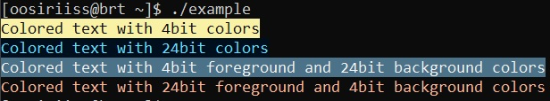

# Rainbowcpp


[](https://opensource.org/licenses/MIT)
[](https://en.cppreference.com/w/cpp/23)

***Compile-time C++23 ANSI color escape codes*** 



## Features

* Supports 4-bit and 24-bit ANSI color escape codes
* Header-only
* Colors are compile-time generated with NTTP

## Installation

**Manually**

Since Rainbowcpp is header-only, you can simply copy the header files in ```./include/``` directly into your project and use them!

**Using CMake (FetchContent)**
```cmake
include(FetchContent)
FetchContent_Declare(
    rainbowcpp
    GIT_REPOSITORY https://github.com/oosiriiss/rainbowcpp
    GIT_TAG 0.3.1 # Or your preferred branch/tag/hash
)
FetchContent_Declare(rainbowcpp)

# Link the target
target_link_libraries(your_target PRIVATE rainbowcpp::rainbowcpp)
```

## TODOs

Rainbowcpp started as a hobby project, and it's primary goal (compile-time terminal colors) is achieved. While the core features are done, I plan to continue improving the "library" and adding new functionality whenever I have free time. Here is what is possibly on the radar:

* [ ] **Text Styles** Add support for  text formatting like **Bold**, *Italic* etc.
* [ ] **Compile-time colored string wrapping** Convenient way to "embed" color codes directly into the format string, without the need to pass colors as format additional arguments.
* And more to come...


## License

Rainbowcpp is licensed under the MIT License. See the [License](./LICENSE) for details.

